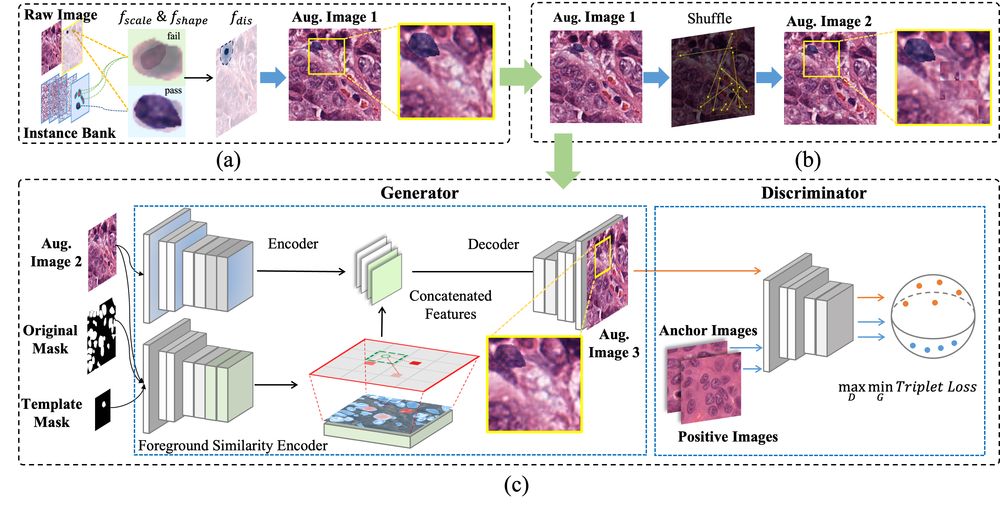

# InsMix

<!-- [[paper](https://arxiv.org/abs/1905.06696).] -->

This is the official code for "InsMix: Towards Realistic Generative Data Augmentation for Nuclei Instance Segmentation (MICCAI 2022, early accepted)"

### Pipeline


### Method


### Useage
The fuctions 'insmix' and 'background shuffle' can be found in 'data_aug.py'.
The example code for dataloader is in 'dataset.py'. Note that it can be used to [BRPNet](https://github.com/csccsccsccsc/brpnet) and [NB-Net](https://github.com/easycui/nuclei_segmentation), which utilize two types of label, i.e., the inner area and the boundary.

### Citation
Pleae cite the paper if you use the code.
```
@inproceedings{lin2022insmix,
  title={{InsMix}: Towards Realistic Generative Data Augmentation for Nuclei Instance Segmentation},
  author={Lin, Yi and Wang, Zeyu and Cheng, Kwang-Ting and Chen, Hao},
  booktitle={International Conference on Medical Image Computing and Computer-Assisted Intervention},
  year={2022},
  organization={Springer}
}
```
### TODO
- [ ] Smooth-GAN.
- [ ] Training and testing on Kumar dataset.
- [ ] Refactor the code to make it more readable.
